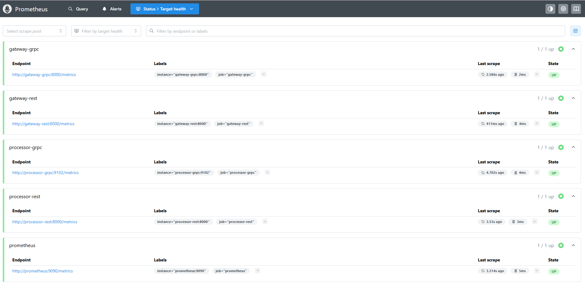

# REST vs gRPC Performance + Prometheus Observability

This project compares latency between a REST-based chain (HTTP/JSON) and a gRPC-based chain (gRPC/Protobuf internally).
Prometheus is integrated as an OSS/CNCF observability tool to scrape metrics from the services (counters + histograms).

---

## Architecture

```
REST chain:
Client -> gateway-rest (8000) -> processor-rest (8001)
                    └-> /metrics

gRPC chain:
Client -> gateway-grpc (8002) --gRPC--> processor-grpc (gRPC 50051)
                    └-> /metrics                └-> metrics on 9102

Prometheus (9090) scrapes:
- gateway-rest  /metrics
- processor-rest /metrics
- gateway-grpc  /metrics
- processor-grpc :9102/metrics
```

---

## Services & Ports

- gateway-rest: http://localhost:8000
- processor-rest: http://localhost:8001
- gateway-grpc: http://localhost:8002
- processor-grpc metrics: http://localhost:9102/metrics
- Prometheus: http://localhost:9090

---

## How to run

From the repo root:

```powershell
docker compose up --build -d
docker compose ps
```

Stop everything:

```powershell
docker compose down
```

---

## How to test

### REST (gateway-rest -> processor-rest)

#### PowerShell

```powershell
$body = @{ value = 123; delay_ms = 0 } | ConvertTo-Json
iwr http://localhost:8000/process -Method Post -ContentType "application/json" -Body $body -UseBasicParsing
```

### gRPC-chain (HTTP to gateway-grpc, gRPC internally to processor-grpc)

```powershell
$body = @{ value = 123; delay_ms = 0 } | ConvertTo-Json
iwr http://localhost:8002/process -Method Post -ContentType "application/json" -Body $body -UseBasicParsing
```

#### bash (with cURL)

```bash
curl -X POST http://localhost:8000/process \
  -H "Content-Type: application/json" \
  -d '{"value":123,"delay_ms":0}'
```

```bash
curl -X POST http://localhost:8002/process \
  -H "Content-Type: application/json" \
  -d '{"value":123,"delay_ms":0}'
```

---

## Observability (Prometheus)

Prometheus UI:
- http://localhost:9090

Targets page (required):
- http://localhost:9090/targets

Required proof screenshot:
- `docs/prometheus-targets.png`

Embed:


### Example PromQL queries (request counters)

**REST request count (by status):**
```promql
sum by (status) (gateway_requests_total{endpoint="/process",method="POST"})
```

**gRPC request count (by status):**
```promql
sum by (status) (gateway_grpc_requests_total)
```

### Example PromQL queries (latency p95 from histogram)

> Run the benchmark first, then execute these queries in Prometheus.
> If you see NaN, increase the time window (e.g. from [1m] to [5m]).

**REST p95:**
```promql
histogram_quantile(
  0.95,
  sum(rate(gateway_latency_seconds_bucket{endpoint="/process",method="POST"}[5m])) by (le)
)
```

**gRPC-chain p95:**
```promql
histogram_quantile(
  0.95,
  sum(rate(gateway_grpc_latency_seconds_bucket[5m])) by (le)
)
```

Optional proof screenshots:
- `docs/prometheus-query-rest.png`
- `docs/prometheus-query-grpc.png`

---

## Latency comparison (REST vs gRPC)

Benchmark script:
- `scripts/benchmark.ps1`

### Test setup

- Local machine: Windows + Docker Desktop
- Payload: `{"value":123,"delay_ms":0}`
- Measured requests: 100
- Warmup: 5

Command used:

```powershell
.\scripts\benchmark.ps1 -N 100 -Warmup 5 -Value 123 -DelayMs 0
```

### Results

Full results are stored in:
- `docs/latency-results.md`

Quick summary (copy the values from `docs/latency-results.md` if needed):

| Path | OK/Total | Avg (ms) | Median (ms) | p95 (ms) |
|---|---:|---:|---:|---:|
| REST (`http://localhost:8000/process`) | 100/100 | 41.660 | 38.511 | 57.960 |
| gRPC-chain (`http://localhost:8002/process`) | 100/100 | 92.934 | 89.760 | 119.895 |

---

## Repo deliverables / proof checklist

- [x] Docker compose runs all services
- [x] Prometheus running on http://localhost:9090
- [x] Targets are UP: screenshot `docs/prometheus-targets.png`
- [x] Latency benchmark script `scripts/benchmark.ps1`
- [x] Benchmark results in `docs/latency-results.md`

